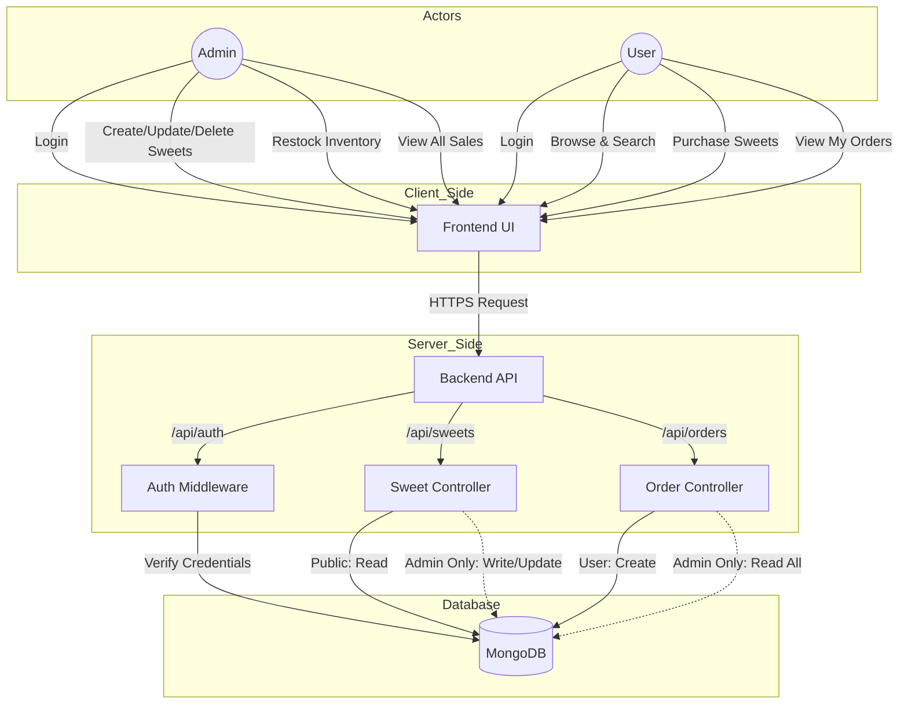
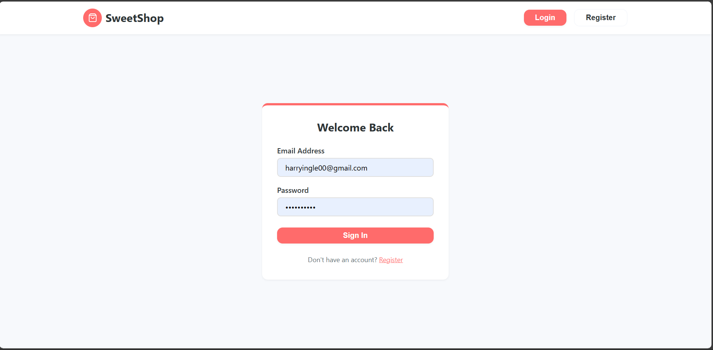
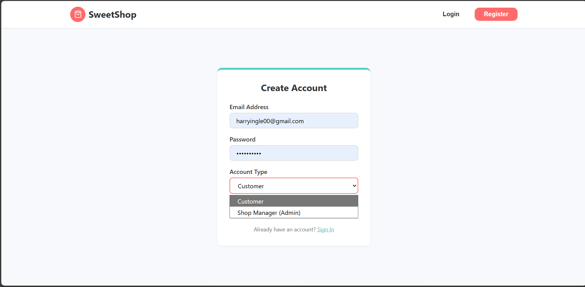
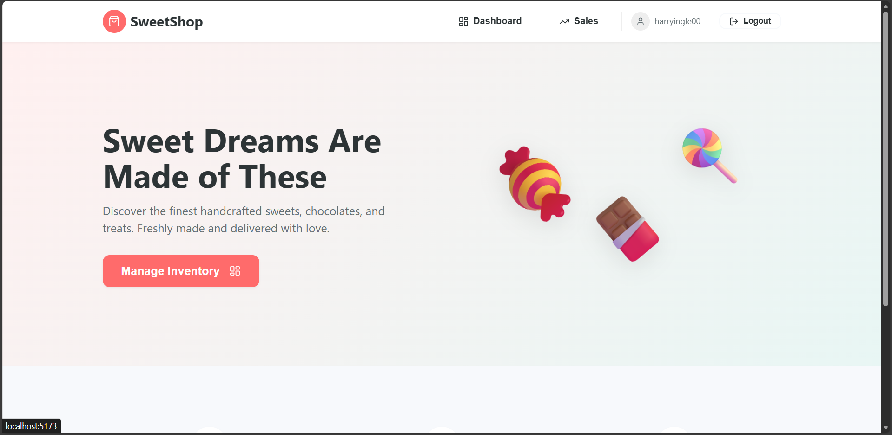
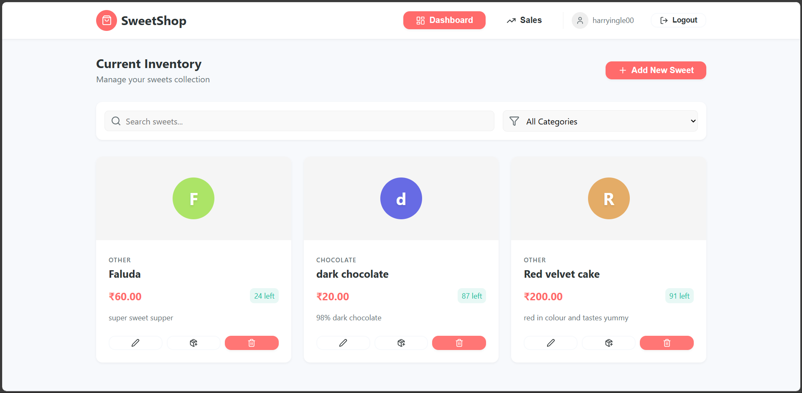
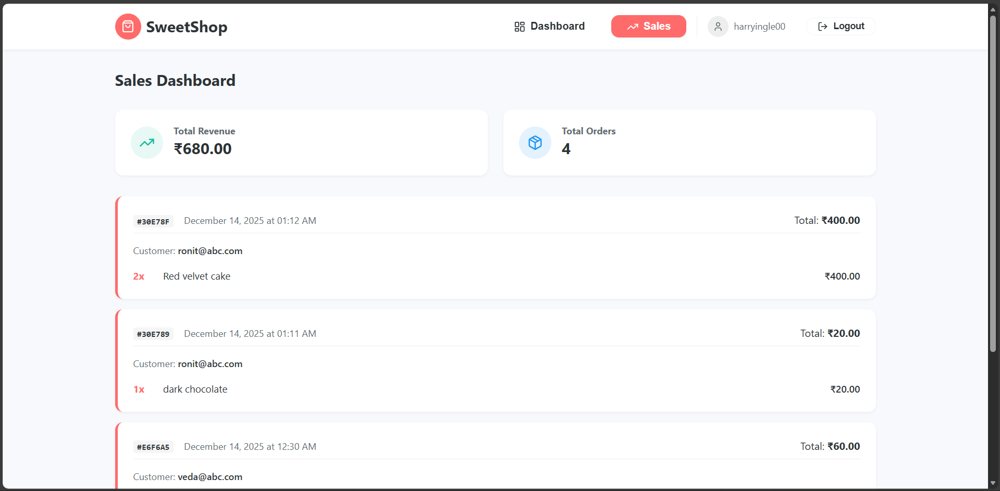
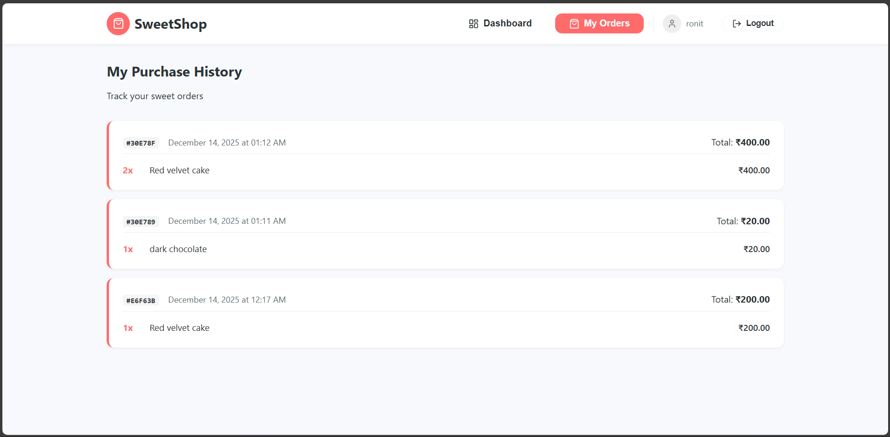
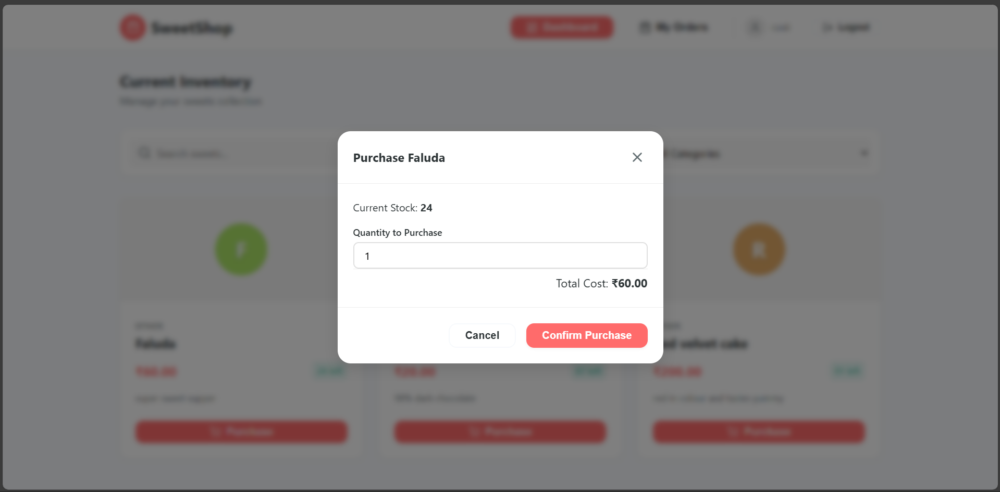
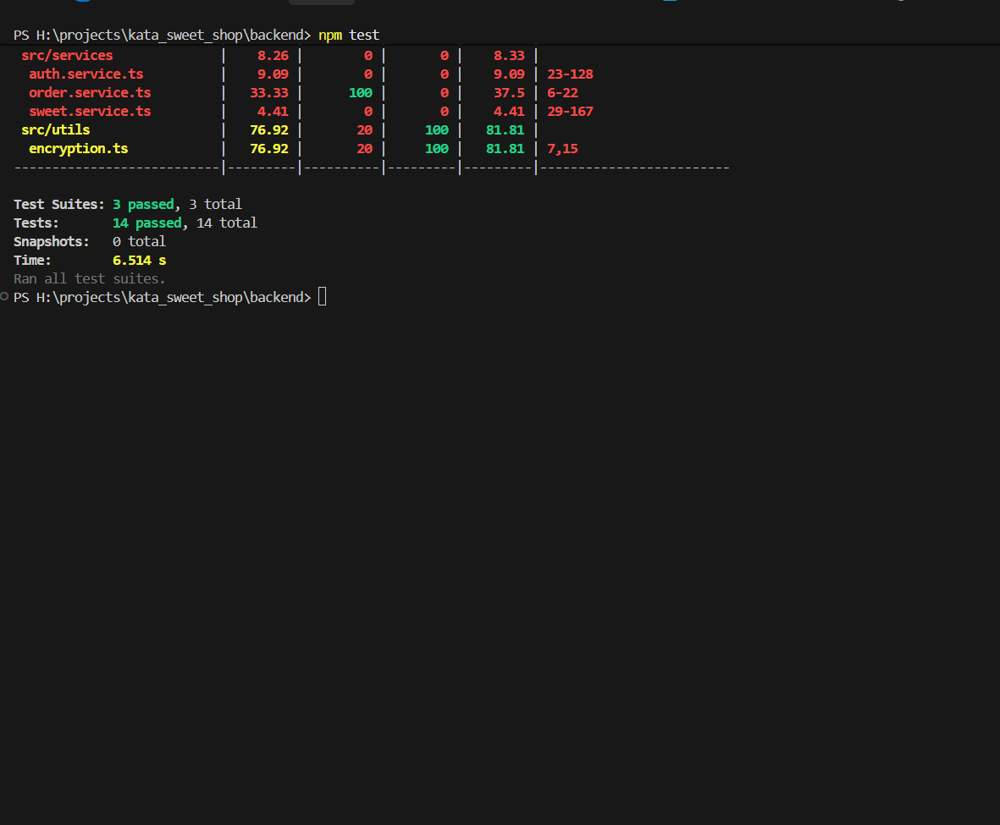

# Kata Sweet Shop

Welcome to the **Kata Sweet Shop**, a modern full-stack web application designed for managing a boutique sweet shop's inventory, sales, and customer interactions. This system provides a seamless experience for customers to browse and purchase sweets, while offering powerful tools for administrators to manage stock and track sales.

## Key Features

*   **User Authentication**: Secure registration and login with role-based access control (Admin/User).
*   **Product Management**: Admins can create, update, delete, and restock sweet inventory.
*   **Search & Filtering**: diverse filtering options by category, price range, and name.
*   **Order Processing**: Users can purchase items; system tracks stock levels automatically.
*   **Sales Analytics**: Admin dashboard for viewing total revenue and order history.
*   **Responsive Design**: Built with React and modern CSS for a fluid experience across devices.

## Tech Stack

**Frontend**
*   **React**: UI Library
*   **Vite**: Build Tool
*   **TypeScript**: Type Safety
*   **Context API**: State Management
*   **React Router**: Navigation

**Backend**
*   **Node.js & Express**: API Server
*   **TypeScript**: Application Logic
*   **MongoDB & Mongoose**: Database & ORM
*   **Jest & Supertest**: Testing Framework
*   **JWT**: Authentication

## Architecture

The application follows a standard Client-Server architecture. The Frontend consumes RESTful APIs provided by the Backend, which interacts with the MongoDB database.



## Screenshots

### Authentication
| Login Page | Registration Page |
|:---:|:---:|
|  |  |

### User Experience
| Home Page | Dashboard |
|:---:|:---:|
|  |  |

### Administration
| Sales Analytics | Order Management |
|:---:|:---:|
|  |  |

### Creation and Purchase
| Creation Popup | Purchase Popup |
|:---:|:---:|
|  |  |


### Quality Assurance
| Testing Reports |
|:---:|
|  |  |

## Getting Started

Follow these instructions to set up the project locally.

### Prerequisites
*   Node.js (v16 or higher)
*   MongoDB (Local running instance or Atlas URI)

### Installation

1.  **Clone the Repository**
    ```bash
    git clone https://github.com/Harry9021/kata_sweet_shop.git
    cd kata_sweet_shop
    ```

2.  **Setup Backend**
    ```bash
    cd backend
    npm install
    
    cp .env.example .env
    
    # Start Server
    npm run dev
    ```

3.  **Setup Frontend**
    ```bash
    cd ../frontend
    npm install
    
    cp .env.example .env
    
    # Start Client
    npm run dev
    ```

## 🧪 Testing

The backend is fully tested using Jest and Supertest.

```bash
cd backend
npm test
```

## 🛡️ Security

*   Data encryption for sensitive information.
*   JWT-based session management.
*   Input validation and sanitization using `express-validator`.

---
*Built with By Harry9021 for the Kata Sweet Shop Project.*
